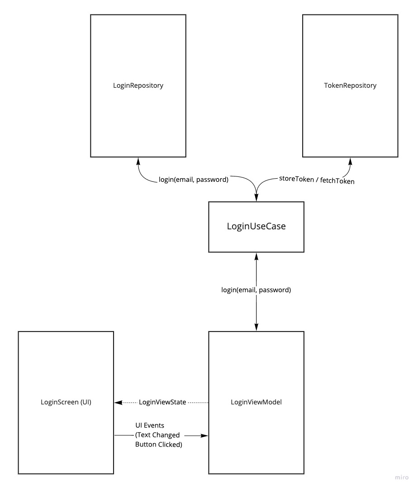

# Modularization

The TOA application uses a multi module structure. Creating an Android with multiple modules can help with optimizing local build times, keeping the codebase organized, and even hiding implementation details from modules that don't need it. 

The overall structure of modules inside the TOA app can be seen in this diagram:

The general principle behind the module design is this:

1. A module to hold all of our core model classes used throughout application.
2. A module to hold all of the data layer logic used by the application.
3. A module to hold all of the core-ui components and theme information. 
4. A module for each individual feature (typically a screen) of the application.
5. An app module that depends on each feature module and connects them accordingly. 

As this application grows in complexity, we may want to add more modules for other isolated concepts our app could use. 

For example, we may one day add an `analytics` module or `error-reporting` module when those tools are implemented. This concept can be seen today by the lint-checks module. 